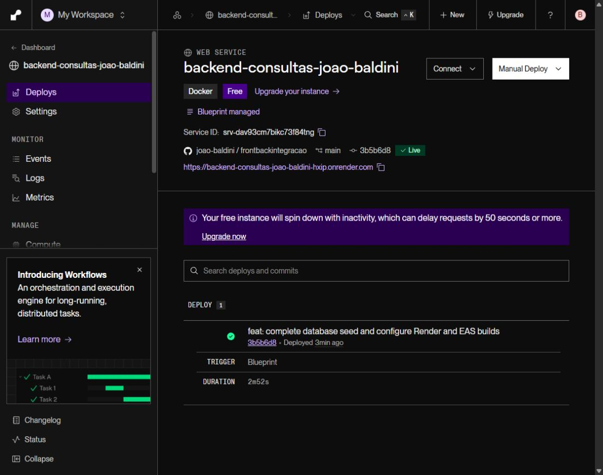
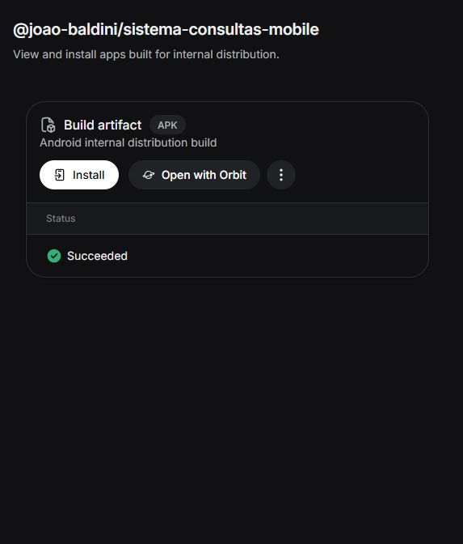
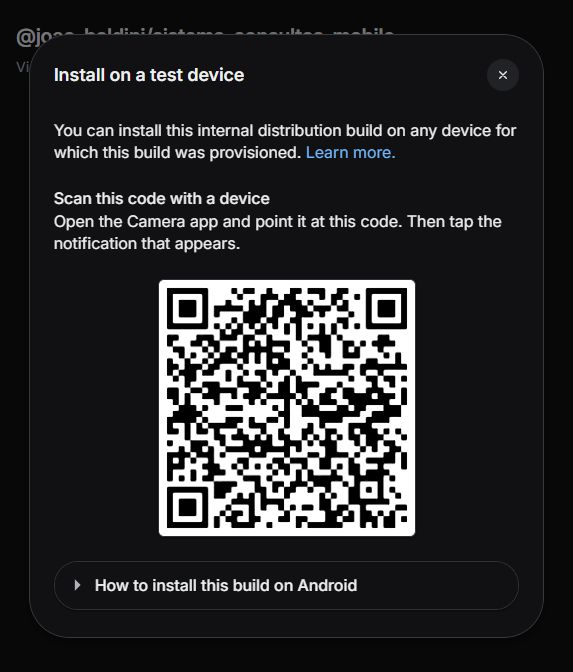
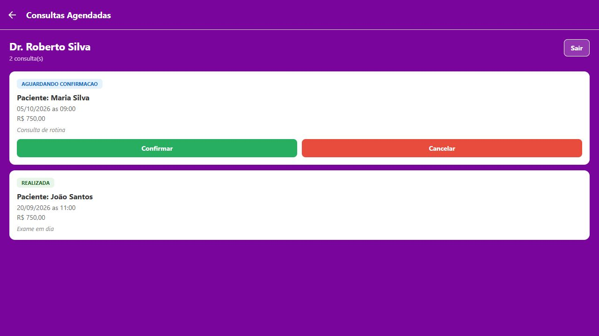
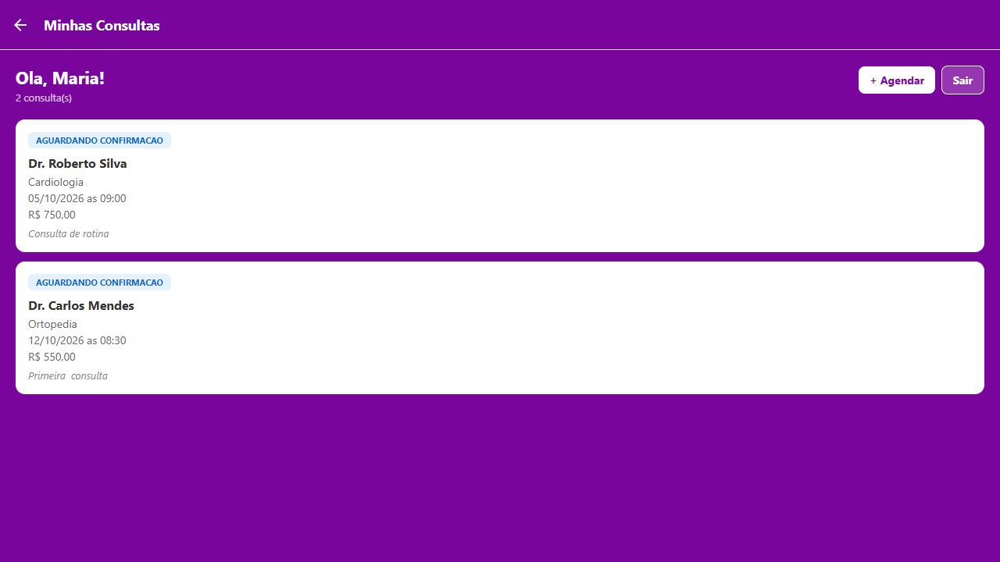

# Consultas médicas — frontend + backend

Este repositório reúne o aplicativo Expo/React Native de
[frontend-consulta-V2](https://github.com/joao-baldini/frontend-consulta-V2)
(base `5bb6599`) e a API Spring Boot de
[backend-consulta-V2](https://github.com/joao-baldini/backend-consulta-V2)
(base `4f0107e`). O frontend acessa `/health`, `/pacientes`, `/medicos`,
`/especialidades` e `/consultas` pela URL configurada em
`EXPO_PUBLIC_API_URL`. A API permite as chamadas do Expo Web via CORS.

## Requisitos

- Java 17
- Node.js e npm
- Dois terminais, um para a API e outro para o aplicativo

## Executar

No primeiro terminal, a partir da raiz do repositório:

```powershell
cd backend
.\mvnw.cmd spring-boot:run
```

Em macOS/Linux, use `./mvnw spring-boot:run`. A API inicia na porta 8080.
Abra `http://localhost:8080/health` para verificar `{"status":"UP"}`.
O banco H2 é criado em `backend/data/`, que não é versionado.

No segundo terminal:

```powershell
cd frontend
npm ci
npm run web
```

Para o Expo Go ou emulador, use `npm start`. A URL padrão é o backend
publicado no Render pessoal, também usada pelo APK. Para usar a API local,
crie `frontend/.env.local` com `EXPO_PUBLIC_API_URL=http://localhost:8080`
no navegador/simulador iOS, `http://10.0.2.2:8080` no emulador Android ou
`http://IP_DA_MAQUINA:8080` no celular físico na mesma rede Wi-Fi.
Reinicie o Expo após alterar a variável. Há um modelo em `frontend/.env.example`.

## Estrutura e verificação

- `backend/`: API Spring Boot, controladores e testes.
- `frontend/`: aplicativo Expo; `src/services/api.ts` configura o cliente HTTP.
- `frontend/src/styles/`: estilos extraídos das 11 telas e do `ConsultaCard`,
  com exportações em `index.ts`. A lógica, o JSX e os valores dos estilos
  originais foram preservados.

```powershell
cd backend
.\mvnw.cmd test

cd ..\frontend
npx tsc --noEmit
npx expo export --platform web
```

Após iniciar ambos, a tela inicial usa `/health` para indicar se a API está
online. Os fluxos de paciente e médico usam os endpoints acima para cadastro,
consulta, agendamento, confirmação e cancelamento.

## Deploy - aula de 29/09/2026

### Backend

Hospedado na conta pessoal do Render:
[backend-consultas-joao-baldini](https://backend-consultas-joao-baldini-hxip.onrender.com).
[Painel do serviço](https://dashboard.render.com/web/srv-dav93cm7bikc73f84tng).

Configuração versionada em `render.yaml`: Docker, Java 17, plano Free,
região Ohio, diretório `backend`, branch `main`, health check `/health` e
deploy automático a cada push. O `Dockerfile` usa build em dois estágios.

| Endpoint | Resultado verificado em 01/10/2026 |
|---|---|
| `GET /health` | HTTP 200, `{"status":"UP"}` |
| `GET /medicos` | HTTP 200, 5 médicos |
| `GET /pacientes` | HTTP 200, 5 pacientes |
| `GET /especialidades` | HTTP 200, 7 especialidades |
| `GET /consultas` | HTTP 200, 6 consultas |
| `GET /medicos/crm/789456` | Dr. Roberto Silva |
| `GET /pacientes/cpf/12345678901` | Maria Silva |

> O plano Free suspende o serviço após inatividade. A primeira requisição
> pode demorar 60 segundos ou mais. Se a tela inicial mostrar indisponibilidade,
> aguarde e toque em **Tentar novamente**. O cliente usa timeout de 15 segundos,
> e a verificação inicial usa 8 segundos.
>
> O H2 usa armazenamento efêmero no Render. Reinicializações e novos deploys
> podem apagar alterações; o `DataLoader` restaura os dados fictícios de exemplo
> sem duplicar tabelas já preenchidas. Para persistência em produção, use um
> banco externo. Este projeto demonstra acesso por CRM/CPF com dados fictícios.



### Frontend - APK Android

Projeto EAS: [@joao-baldini/sistema-consultas-mobile](https://expo.dev/accounts/joao-baldini/projects/sistema-consultas-mobile).
O perfil `preview` de `frontend/eas.json` gera um APK de distribuição interna;
`production` gera AAB. Ambos usam explicitamente a URL do Render acima.
O app tem pacote `com.joaobaldini.sistemaconsultas`, versão `1.0.0`,
`versionCode: 1` e projeto EAS `60b88e14-8640-4a2e-81da-1f43da874328`.

```powershell
cd frontend
npx eas-cli login
npm run build:apk
# Opcional, para publicação futura nas lojas:
npm run build:aab
npm run build:ios
```

[Build Android no Expo](https://expo.dev/accounts/joao-baldini/projects/sistema-consultas-mobile/builds/d666060c-5c51-444c-971a-e32e48c458d3),
concluído com sucesso (**FINISHED / Succeeded**) em **01/10/2026 às 16h25,
horário de Brasília**, com o perfil `preview`. Verificado em 02/10/2026.

**[Baixar APK Android - Sistema de Consultas 1.0.0](https://expo.dev/artifacts/eas/r9KODIfjXHtFX70z6sWl6ZvvZt9B-gNJmaXE9on2r3k.apk)**

- Tamanho: 65.687.850 bytes (aproximadamente 62,6 MiB).
- Pacote: `com.joaobaldini.sistemaconsultas`; versão `1.0.0`; `versionCode: 1`.
- Código compilado: commit `33055eb0a5ff47eef371cae01d1c38600e3b1bf4`.
- SHA-256 do arquivo baixado: `AA882A2ED82820B06C51E43AE908D4A9454576CB672D100070CF3143AE211A13`.
- O APK foi baixado e teve a integridade ZIP verificada, com manifesto Android,
  arquivos DEX e bundle contendo a URL do backend pessoal no Render.



#### QR Code do build - Expo Dashboard / EAS



Este é o print do QR Code exibido pelo botão **Install** do build concluído no
dashboard do Expo. Ele abre a página de instalação do APK e não depende do Expo Go
ou do computador ligado.

Para instalar, abra o link do build no Android, baixe o APK e permita
instalação de apps desconhecidos apenas para o instalador usado. Depois abra
**Sistema de Consultas**, aguarde a conexão e use as credenciais abaixo.
Mudanças no frontend exigem um novo APK; incremente a versão e `versionCode`.

### Credenciais fictícias de teste

| Perfil | Campo | Valor |
|---|---|---|
| Médico - Dr. Roberto Silva | CRM | `789456` |
| Médico - Dra. Ana Ferreira | CRM | `123789` |
| Médico - Dr. Carlos Mendes | CRM | `456123` |
| Paciente - Maria Silva | CPF | `12345678901` |
| Paciente - João Santos | CPF | `98765432100` |
| Paciente - Ana Costa | CPF | `11122233344` |

### Checklist da entrega

- [x] Backend publicado na conta pessoal do Render e `/health` respondendo.
- [x] Seed completo de especialidades, médicos, pacientes e consultas.
- [x] `api.ts` apontando por padrão para a URL própria do Render.
- [x] `app.json` com pacote Android, `versionCode`, splash e projeto EAS.
- [x] `eas.json` com perfis preview/APK e production/AAB.
- [x] Build Android finalizado no EAS e APK disponível para download.
- [ ] APK instalado e testado em um celular Android físico.
- [ ] Login no APK com o backend Render.
- [x] Print do QR Code do dashboard no README.
- [x] Frontend, backend, configuração de deploy e documentação commitados e enviados ao GitHub.

Validação local: 3 testes Maven aprovados, TypeScript sem erros, 18/18 checks
do Expo Doctor aprovados e exportações Android e web concluídas. Os endpoints
publicados foram verificados por HTTP, e os dois
logins foram testados no frontend web usando o backend publicado.





**Não tenho acesso a um dispositivo Android.** Por isso, a instalação do APK
e os testes de login no celular físico estão pendentes. Todas as entregas que
independem do aparelho foram concluídas: publicação do backend, configuração do
frontend, build Android no EAS, APK para download, print do QR Code e documentação
no GitHub. Os testes no navegador e a verificação do arquivo não comprovam a
instalação e execução do APK no celular.

O Expo foi atualizado para o patch compatível `~54.0.37`, e foram aplicadas
correções de dependências sem alterar a versão principal do SDK. O `npm audit`
passou de 28 alertas (2 críticos) para 12 (10 moderados e 2 altos, nenhum crítico).
A atualização das ferramentas transitivas restantes permanece pendente para
uso em produção; algumas correções exigem migração de versão principal do Expo.
